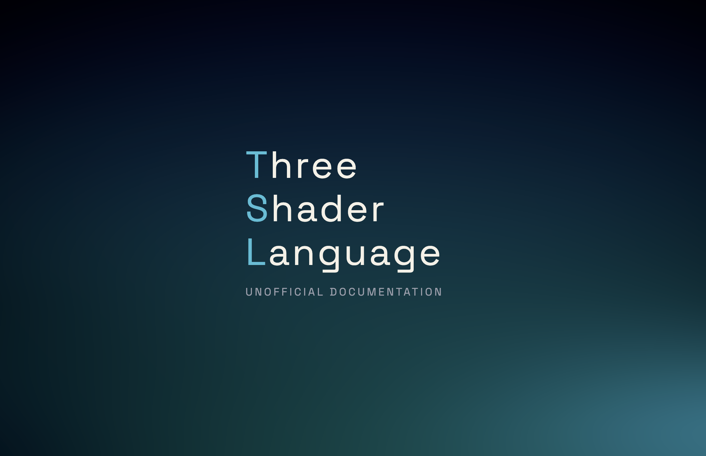

  <a href="https://tsl-docs.vercel.app/">
    <picture>
      <source media="(prefers-color-scheme: dark)" srcset="/assets/tsl.png">
      
    </picture>
  </a>

## TSL Docs

Unoffical documentation site for Three Shading Language (TSL). 

### Why?

The goal of this project is to provide an up to date reference of the TSL api that includes type information and highlighted code blocks.
This project was a way for me to build something with two libraries that I wanted to learn more about, TSL and Renoun. 

### Features
- Typeahead search 
- Highlighted code blocks
- Generates structured data from three.js src/nodes folder (remote source) 

 
